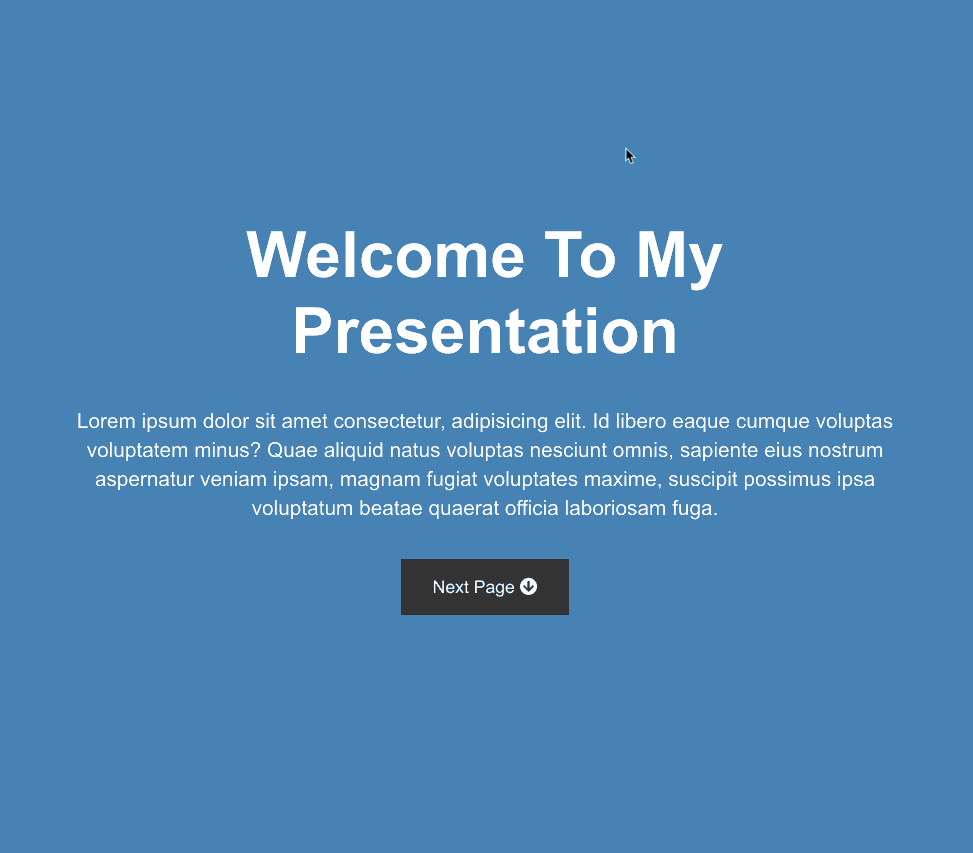

# Presentation website

A website to use as a boilerplate for future presentations. Now covering four pages with next and previous page buttons and smooth scroll between the pages. Built with CSS Flexbox, using jQuery for the smooth scrolling.

Icons are taken from Fontawsome via CDN.

## Screenshot

On desktop

## Author
* Albert Stjärne (https://github.com/AlbertStjarne)